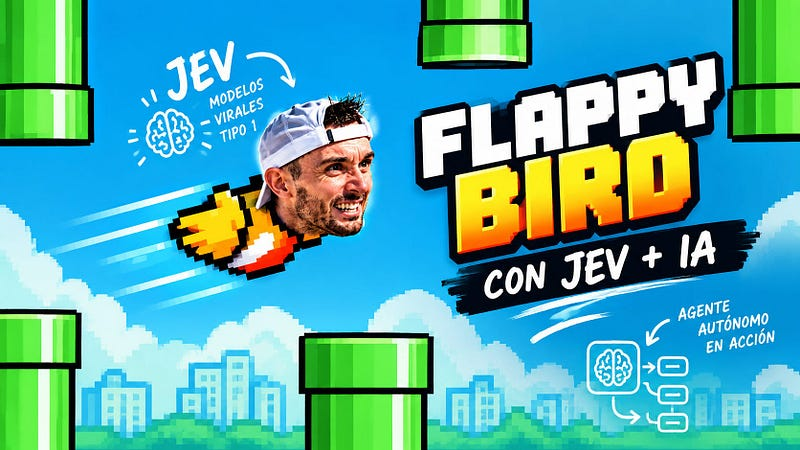
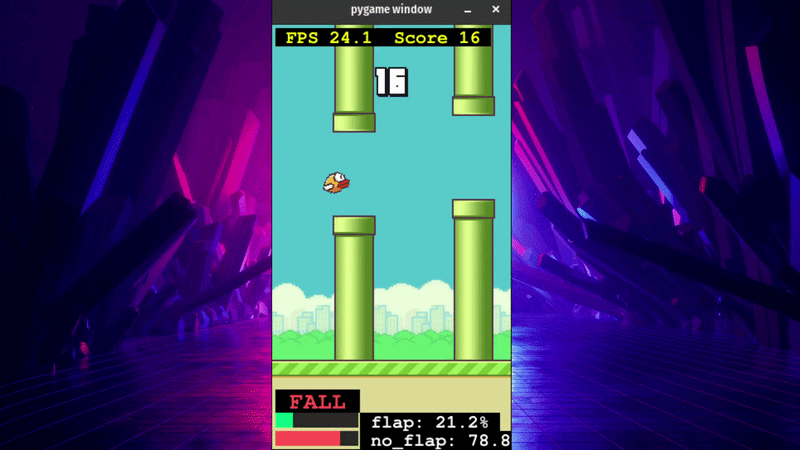
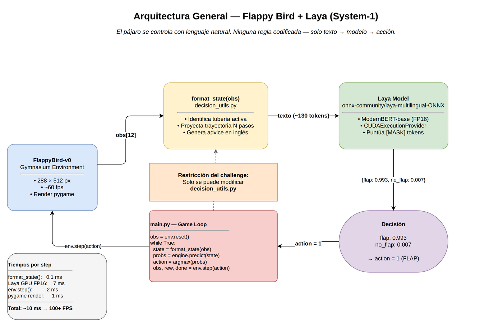
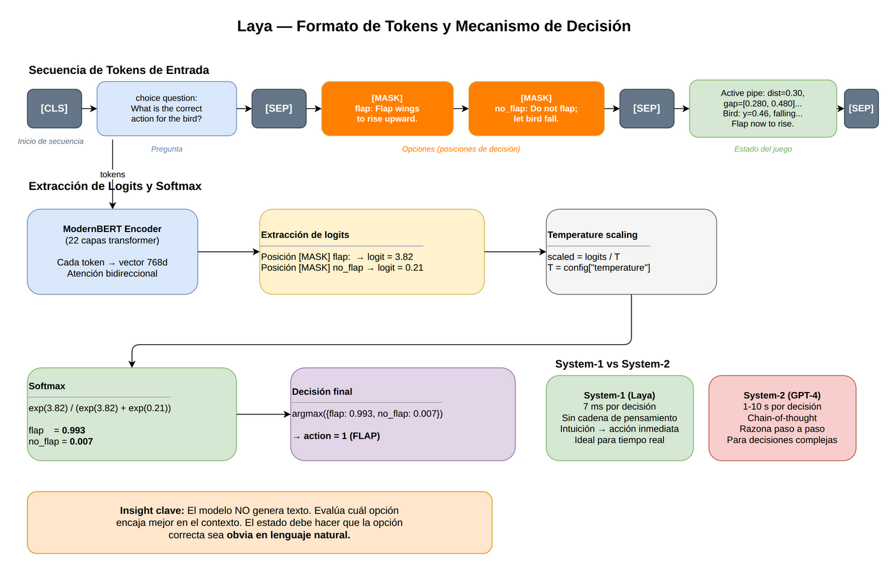

[](https://iamdgarcia.substack.com)

# 🐦 Flappy Bird × Laya

**Controlling Flappy Bird with natural language — no game-specific training, no Q-learning, no hardcoded rules.**

At every frame, the game state is described in plain text and the [Laya](https://huggingface.co/inferenceprince/laya-onnx-int8) model decides: **flap** or **fall**.



---

## Demo



---

## Architecture



The pipeline has three moving parts, each in its own file:

| File | Role |
|---|---|
| `main.py` | Game loop, pygame overlay (FPS, score, probability bars), pipelined inference |
| `engine.py` | Loads the Laya ONNX model from HuggingFace, tokenizes, runs inference, returns softmax probabilities |
| `decision_utils.py` | Physics constants, trajectory projection, `format_state()`, question & options |
| `run.sh` | Launcher — patches `LD_LIBRARY_PATH` for GPU CUDA libs, then runs `main.py` |
| `TUTORIAL.md` | Full engineering walkthrough (Spanish): from naïve state to 15+ pipe score |

**Timing per step (GPU FP16):** `format_state` 0.1 ms · Laya inference 7 ms · `env.step` 2 ms · pygame render 1 ms → **~10 ms total → 100+ FPS**

---

## How Laya decides



Laya is a **System-1** model: fast, intuitive decisions from context — the same way a human expert reacts without stopping to reason.

The model **never generates text**. It scores which option fits the context best by reading logits from the `[MASK]` positions, then applies temperature scaling and softmax:

```
[CLS] choice question: What is the correct action? [SEP]
[MASK] flap: Flap wings to rise upward.
[MASK] no_flap: Do not flap; let the bird fall.  [SEP]
Active pipe: dist=0.30, gap=[0.280,0.480]...     [SEP]
```

→ `{ flap: 0.993, no_flap: 0.007 }` → **action = 1 (FLAP)**

The key insight: **the state description must make the correct option obvious in natural language**. That's the whole engineering challenge.

---

## The environment

![Coordinate system and obs[12] vector](diagrams/img/03_entorno_coordenadas.png)

All coordinates are normalized to `[0, 1]`. The `obs[12]` vector:

| Index | Variable | Description |
|---|---|---|
| obs[0] | pipe_0_x | Nearest pipe, X position |
| obs[1] | pipe_0_top | Gap top edge |
| obs[2] | pipe_0_bot | Gap bottom edge |
| obs[3..5] | pipe_1_x/top/bot | Second pipe |
| obs[6..8] | pipe_2_x/top/bot | Third pipe |
| obs[9] | player_y | Bird vertical position |
| obs[10] | player_vel | Vertical velocity (+ = falling) |
| obs[11] | player_rot | Rotation (unused) |

---

## `format_state()` — how the state is built


`decision_utils.py` converts the raw `obs[12]` floats into a sentence the model can act on:

1. **Pick the active pipe** — the nearest one still overlapping the bird (`pipe_x > 0.019`)
2. **Project the no-flap trajectory** N steps ahead under gravity (`_project_minmax`)
3. **Choose advice** — will the bird hit the bottom pipe? The top? Is it on track?
4. **Emit the state string** with all relevant numbers + the plain-English advice

**Example output:**
```
Active pipe: dist=0.31, gap=[0.412,0.608] (center 0.510).
Bird: y=0.481, falling (vel=+0.18).
No-flap range over 8 steps: [0.481,0.614] — will hit BOTTOM pipe.
Flap now to rise into the gap. Next gap center: 0.523.
```

---

## Quick start

```bash
# 1. Create a virtual environment
python -m venv venv && source venv/bin/activate

# 2. Install dependencies
pip install onnxruntime numpy tokenizers huggingface_hub \
            flappy-bird-gymnasium gymnasium pygame

# 3. Run
./run.sh          # GPU (patches CUDA libs automatically)
# or
python main.py    # CPU fallback
```

> **GPU note:** `run.sh` expects NVIDIA CUDA 12 runtime libs from `onnxruntime-gpu`.  
> CPU-only? Just `pip install onnxruntime` (not `onnxruntime-gpu`) and run `python main.py` directly.

The model ([`inferenceprince/laya-onnx-int8`](https://huggingface.co/inferenceprince/laya-onnx-int8)) is downloaded automatically on first run via `huggingface_hub`.

---

## Read the full story

Detailed tutorial — engineering the state representation step by step, bugs found, physics reverse-engineered, GPU optimization — on Substack:

**[iamdgarcia.substack.com](https://iamdgarcia.substack.com)**

Also see [`TUTORIAL.md`](TUTORIAL.md) for the complete walkthrough included in this repo.
