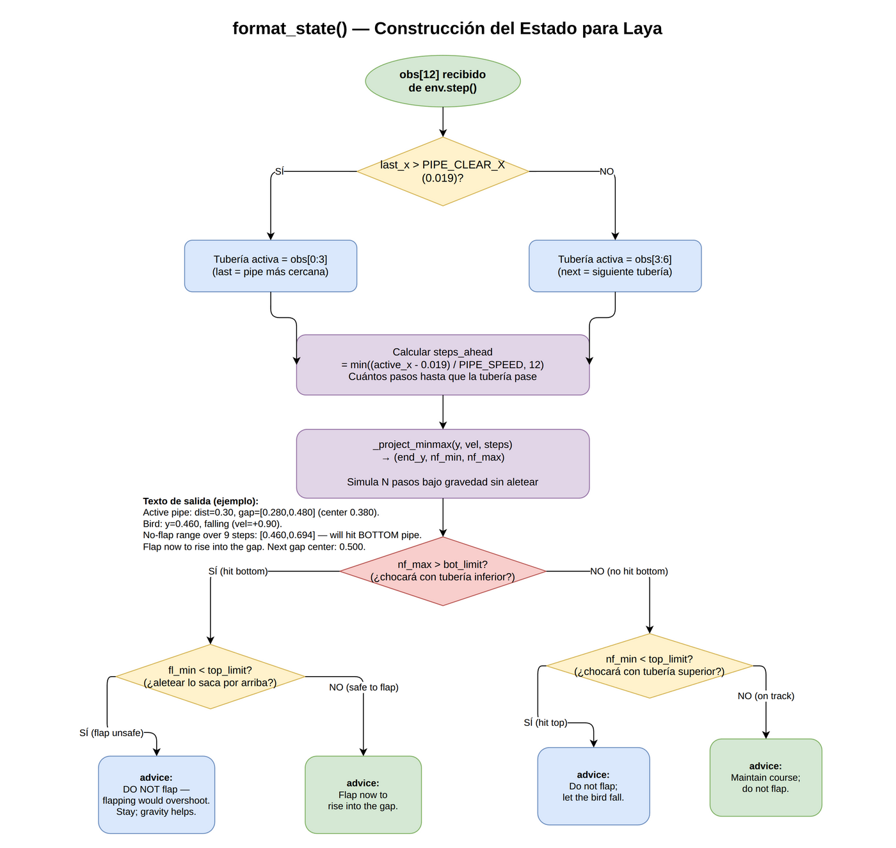

# 🐦 Flappy Bird con Laya: De Cero a 15 Tuberías
### Un tutorial completo de ingeniería de estado para modelos de decisión System-1

---

## Índice

1. [¿Qué vamos a construir?](#1-qué-vamos-a-construir)
2. [El modelo Laya: cómo funciona](#2-el-modelo-laya-cómo-funciona)
3. [El entorno: Flappy Bird Gymnasium](#3-el-entorno-flappy-bird-gymnasium)
4. [Ciclo principal del juego](#4-ciclo-principal-del-juego)
5. [El problema central: generar el estado](#5-el-problema-central-generar-el-estado)
6. [Iteración 1 — Estado ingenuo (score: 0)](#6-iteración-1--estado-ingenuo-score-0)
7. [Depuración: ¿por qué muere el pájaro?](#7-depuración-por-qué-muere-el-pájaro)
8. [Los bugs encontrados (uno a uno)](#8-los-bugs-encontrados-uno-a-uno)
9. [Iteración final — Estado con física real (score: 15+)](#9-iteración-final--estado-con-física-real-score-15)
10. [Optimización de rendimiento: GPU](#10-optimización-de-rendimiento-gpu)
11. [Resultados y lecciones aprendidas](#11-resultados-y-lecciones-aprendidas)

---

## 1. ¿Qué vamos a construir?

Vamos a controlar el pájaro de Flappy Bird usando **únicamente lenguaje natural** — sin redes neuronales entrenadas para el juego, sin Q-learning, sin reglas codificadas a mano.

La idea: en cada frame del juego, describimos la situación en texto, y un modelo de lenguaje decide si el pájaro debe **aletear** o **caer**.


**Restricción importante:** solo podemos modificar `decision_utils.py` — el archivo que convierte la observación numérica en texto y define la pregunta al modelo.

---

## 2. El modelo Laya: cómo funciona

Laya es un modelo **System-1**: toma decisiones rápidas e intuitivas basadas en contexto, como un humano experto que responde de inmediato sin deliberar.

### 2.1 Sistema 1 vs Sistema 2


### 2.2 Formato de entrada de Laya

Laya usa un formato específico basado en BERT con tokens especiales `[MASK]` para marcar las opciones:


### 2.3 Clave del diseño

> **El estado que escribimos DEBE hacer que la opción correcta parezca obvia en lenguaje natural.**
> Si el texto dice *"el pájaro chocará con la tubería inferior"*, el `[MASK]` de "aletear" 
> debe encajar mejor en ese contexto que el de "no aletear".

---

## 3. El entorno: Flappy Bird Gymnasium

### 3.1 La observación (12 valores)

En cada step el entorno devuelve un array de 12 números normalizados:

```
obs = [
  pipe_0_x,    pipe_0_top,  pipe_0_bot,   # ← tubería más cercana (obs[0:3])
  pipe_1_x,    pipe_1_top,  pipe_1_bot,   # ← segunda tubería    (obs[3:6])
  pipe_2_x,    pipe_2_top,  pipe_2_bot,   # ← tercera tubería    (obs[6:9])
  player_y,    player_vel,  player_rot    # ← estado del pájaro  (obs[9:12])
]
```

Las tuberías están **ordenadas por posición x** (la más a la izquierda primero).

### 3.2 Sistema de coordenadas

![Sistema de coordenadas y obs\[12\]](diagrams/img/03_entorno_coordenadas.png)

### 3.3 Física del juego (constantes reales)

```python
PLAYER_MAX_VEL_Y =  10  px/frame  →  vel_norm_max = +1.00  (caída máxima)
PLAYER_ACC_Y     =   1  px/frame  →  gravedad_norm = +0.10 por step
PLAYER_FLAP_ACC  =  -9  px/frame  →  vel tras aletear = -0.90
PIPE_VEL_X       =  -4  px/frame  →  velocidad tubería = 4/288 ≈ 0.014/step
screen_width     = 288  px
screen_height    = 512  px
VEL_SCALE        = 10/512 ≈ 0.02  →  Δy por step = vel_norm × 0.02
```

### 3.4 Geometría de colisión



---

## 4. Ciclo principal del juego

```python
# main.py — estructura simplificada
env    = gymnasium.make("FlappyBird-v0", render_mode="human")
engine = LayaJevEngine()          # carga el modelo ONNX
obs, _ = env.reset()

while True:
    state_desc = format_state(obs)      # 1. observación → texto
    probs = engine.predict_choice(      # 2. texto → probabilidades
        state_text=state_desc,
        question=question,
        options=options
    )
    action = 1 if probs["flap"] > probs["no_flap"] else 0  # 3. decisión
    obs, reward, terminated, _, info = env.step(action)     # 4. ejecutar
    if terminated: break
```


---

## 5. El problema central: generar el estado

`format_state(obs)` es **todo**. El modelo no ve los números crudos — solo ve el texto que nosotros generemos. Nuestro trabajo es traducir 12 números a una descripción en lenguaje natural tan clara que el modelo tome la decisión correcta.

### 5.1 Lo que el modelo necesita saber


---

## 6. Iteración 1 — Estado ingenuo (score: 0)

### 6.1 Primera implementación

El estado inicial era una descripción básica usando las tres tuberías:

```python
# Versión inicial (¡con bugs!)
def format_state(obs):
    next_x, next_top, next_bottom = obs[3], obs[4], obs[5]  # ← BUG: tubería incorrecta
    player_y, player_vel = obs[9], obs[10]
    gap_center = (next_top + next_bottom) / 2.0
    error = player_y - gap_center
    ...
    return f"FLIGHT ANALYSIS:\n- Next Gap Center: {gap_center:.3f}...\n- Hazard: {hazard_str}"

question = "How should the bird adjust its trajectory to align with the gap center target?"
options = {
    "flap": "Flap wings to gain altitude and move higher toward target center.",
    "no_flap": "Coast/fall to drop altitude and move lower toward target center."
}
```

**Resultado:** El pájaro moría en el paso 50, score = 0 tuberías.

### 6.2 ¿Por qué fallaba?

Lo averiguamos con un script de depuración que registraba la posición exacta en cada step:

```
=== RUN 1  pipes=0  died step=50 ===
  step=41 | last_x=0.43 last_gap=0.410 | next_x=0.93 | y=0.291 vel=+0.40 | FLAP ← ¡ALETEA!
  step=42 | last_x=0.42 last_gap=0.410 | next_x=0.92 | y=0.273 vel=-0.90 | fall
  step=49 | last_x=0.32 last_gap=0.410 | next_x=0.82 | y=0.219 vel=-0.30 | fall
  # El pájaro muere: y=0.219 < gap_top≈0.332 → por encima del techo del hueco
```

---

## 7. Depuración: ¿por qué muere el pájaro?

### 7.1 Metodología

Creamos `debug_run.py` para correr el juego sin interfaz gráfica y registrar la muerte exacta:

```python
# debug_run.py
env = gymnasium.make("FlappyBird-v0", render_mode="rgb_array")  # sin ventana = más rápido
history = []
while True:
    state_desc = format_state(obs)
    probs = engine.predict_choice(...)
    history.append({"step": step, "y": obs[9], "last_x": obs[0], ...})
    obs, reward, terminated, _, info = env.step(action)
    if terminated:
        print(f"pipes={info['score']}  died step={step}")
        print(history[-10:])  # últimos 10 pasos antes de morir
        break
```

### 7.2 El análisis de la muerte

```
ANÁLISIS DE LA MUERTE (paso 50):

  Pantalla (y aumenta hacia abajo):
  
  y=0.0 ┌──────────────────────────────────┐
        │         ████████████             │
        │         ████████████  ← tubería  │
  y=0.28│·················top·············│← borde superior del hueco
        │                                  │
  y=0.41│·············center·············· │← centro del hueco
        │                                  │
  y=0.51│·············bottom··············│← borde inferior del hueco
        │         ████████████  ← tubería  │
  y=1.0 └──────────────────────────────────┘

  Estado del pájaro en el paso 49: y=0.219
                                        ↑
                              ¡ENCIMA de la tubería superior!
                              (0.219 < 0.280 = gap_top)
```

---

## 8. Los bugs encontrados (uno a uno)

Encontramos **5 bugs críticos** en secuencia, usando `debug_run.py` para confirmar cada uno.

### Bug 1 — Tubería objetivo equivocada 🎯

```
┌──────────────────────────────────────────────────────────────────┐
│                      BUG #1 — TUBERÍA ERRÓNEA                     │
│                                                                    │
│  obs[0:3] = tubería más a la izquierda = tubería ACTIVA           │
│  obs[3:6] = siguiente tubería = ¡la que viene DESPUÉS!            │
│                                                                    │
│  Código original usaba obs[3:6] como objetivo ← MAL               │
│                                                                    │
│  Pantalla:                                                         │
│                                                                    │
│   obs[0] (active)      obs[3] (next)       obs[6] (nn)           │
│       ▼                    ▼                   ▼                  │
│  ████ ▓▓▓▓ ██              ████                ████               │
│       HUECO                HUECO               HUECO              │
│  ████ ▓▓▓▓ ██              ████                ████               │
│         ↑                                                          │
│       🐦 pájaro fijo en x=0.20                                    │
│                                                                    │
│  El pájaro apunta al SEGUNDO hueco mientras choca con el PRIMERO  │
└──────────────────────────────────────────────────────────────────┘

FIX: usar obs[0:3] como tubería activa mientras last_x > PIPE_CLEAR_X
```

### Bug 2 — Escala de velocidad incorrecta 📐

```
┌──────────────────────────────────────────────────────────────────┐
│                   BUG #2 — ESCALA DE VELOCIDAD                    │
│                                                                    │
│  Código original proyectaba: y_futuro = y + vel × N_pasos         │
│                                                                    │
│  PROBLEMA: vel es velocidad NORMALIZADA, no Δy directo            │
│                                                                    │
│  La relación real (derivada de observaciones):                     │
│                                                                    │
│    Δy por step = vel_normalizada × (PLAYER_MAX_VEL_Y / screen_h)  │
│               = vel × (10 / 512)                                   │
│               = vel × 0.0195   ← ¡no × 1!                         │
│                                                                    │
│  Con vel=-0.90: código viejo predice Δy = -0.90 (¡90% pantalla!)  │
│                 código correcto:    Δy = -0.90 × 0.02 = -0.018   │
│                                                                    │
│  Error = 50× → proyecciones completamente inútiles                │
│  Resultado: el pájaro aleteaba cada frame → salía por el techo    │
└──────────────────────────────────────────────────────────────────┘

VERIFICACIÓN con datos reales:
  step 12: y=0.412, vel=+0.20 (no flap)
  step 13: y=0.418, vel=+0.30
  Δy = 0.418 - 0.412 = 0.006 = 0.20 × 0.02  ✓  SCALE = 10/512
```

### Bug 3 — Velocidad máxima incorrecta 🚀

```
┌──────────────────────────────────────────────────────────────────┐
│                  BUG #3 — CAP DE VELOCIDAD                        │
│                                                                    │
│  PLAYER_MAX_VEL_Y = 10 px/frame → vel_norm_max = 10/10 = 1.00    │
│                                                                    │
│  Código tenía: vel = min(vel + 0.10, 0.90)  ← MAL                │
│  Correcto:     vel = min(vel + 0.10, 1.00)  ← BIEN               │
│                                                                    │
│  Efecto: la proyección subestimaba la velocidad de caída          │
│  cuando el pájaro estaba en caída libre máxima                    │
└──────────────────────────────────────────────────────────────────┘
```

### Bug 4 — Zona de limpieza de tubería 🧹

```
┌──────────────────────────────────────────────────────────────────┐
│              BUG #4 — CAMBIO DE TUBERÍA PREMATURO                 │
│                                                                    │
│  Código cambiaba a "siguiente tubería" cuando last_x < 0.20       │
│  (bird_x = 0.20)                                                  │
│                                                                    │
│  PROBLEMA: la tubería tiene ANCHO = 52 px = 0.181 norm            │
│  La tubería sigue solapando al pájaro hasta que:                  │
│    pipe_x + PIPE_WIDTH < bird_x                                   │
│    pipe_x < 0.20 - 0.181 = 0.019  ← PIPE_CLEAR_X correcto        │
│                                                                    │
│  ┌────────────────────────────────────────────────────────┐       │
│  │         pipe_x=0.15  bird_x=0.20                       │       │
│  │                                                         │       │
│  │    ←52px→                                               │       │
│  │  ┌────────┐     🐦                                      │       │
│  │  │ tubería│←────│──────── TODAVÍA SOLAPANDO             │       │
│  │  └────────┘                                             │       │
│  │   x=0.15  x=0.33                                       │       │
│  └────────────────────────────────────────────────────────┘       │
│                                                                    │
│  Con el cambio prematuro: el modelo decidía para la SIGUIENTE     │
│  tubería mientras el pájaro aún necesitaba pasar la ACTUAL        │
└──────────────────────────────────────────────────────────────────┘
```

### Bug 5 — Señal ambigua "espera un paso" 💬

```
┌──────────────────────────────────────────────────────────────────┐
│                 BUG #5 — LENGUAJE AMBIGUO                         │
│                                                                    │
│  Situación: el pájaro va a chocar con la tubería inferior         │
│  PERO si aletea ahora, se irá por encima del techo               │
│                                                                    │
│  Estado original:                                                  │
│  "Do not flap yet; wait one more step before flapping."           │
│                    ───────────────────────────────────            │
│                    ¡El modelo lo interpreta como señal de aletear! │
│                    Probabilidad de flap: 0.68 → ALETEA ← MAL     │
│                                                                    │
│  Estado corregido:                                                 │
│  "DO NOT flap — flapping would send bird to y=0.095,             │
│   above the gap top at 0.195. Stay the course;                   │
│   gravity moves the bird toward the gap."                         │
│   ──────────────────────────────────────────────────             │
│   Probabilidad de flap: 0.08 → NO ALETEA ← BIEN                 │
│                                                                    │
│  LECCIÓN: el modelo de lenguaje es literal. El texto debe ser     │
│  inequívoco. "espera" implica "actúa pronto" = señal de flap.    │
└──────────────────────────────────────────────────────────────────┘
```

---

## 9. Iteración final — Estado con física real (score: 15+)

### 9.1 Lógica de decisión con proyección

```


### 9.2 Código final de `decision_utils.py`

```python
BIRD_X       = 0.20      # posición horizontal fija del pájaro
PIPE_CLEAR_X = 0.019     # tubería despejada cuando pipe_x < esto
COLLISION_X  = 0.318     # colisión empieza cuando pipe_x < esto
PIPE_SPEED   = 4 / 288   # velocidad normalizada de la tubería
VEL_SCALE    = 10 / 512  # Δy por step = vel_norm × VEL_SCALE
GRAVITY      = 1 / 10    # aceleración gravitatoria normalizada
FLAP_VEL     = -9 / 10   # velocidad tras aletear (normalizada)
MAX_VEL      = 10 / 10   # velocidad máxima de caída
MARGIN       = 0.04      # margen de seguridad respecto al hueco
MAX_STEPS    = 12        # horizonte máximo de proyección

def _project_minmax(y, vel, steps):
    """Simula N pasos bajo gravedad. Devuelve (final, mín, máx)."""
    min_y = max_y = y
    for _ in range(steps):
        vel = min(vel + GRAVITY, MAX_VEL)
        y  += vel * VEL_SCALE
        if y < min_y: min_y = y
        if y > max_y: max_y = y
    return y, min_y, max_y
```

### 9.3 Ejemplos de estados generados

**Caso: Pájaro debe aletear**
```
Active pipe: dist=0.30, gap=[0.280,0.480] (center 0.380).
Bird: y=0.460, falling (vel=+0.90).
No-flap range over 9 steps: [0.460,0.694] — will hit BOTTOM pipe.
Flap now to rise into the gap.
Next gap center: 0.500.
```
→ Laya: **flap=0.993** ✅

**Caso: Pájaro debe esperar (aletear lo haría chocarse con el techo)**
```
Active pipe: dist=0.45, gap=[0.280,0.480] (center 0.380).
Bird: y=0.350, falling (vel=+0.40).
No-flap range over 12 steps: [0.350,0.555] — approaching bottom pipe.
DO NOT flap — flapping would send bird to y=0.280, above the gap top at 0.280.
Stay the course; gravity moves the bird toward the gap.
Next gap center: 0.500.
```
→ Laya: **no_flap=0.751** ✅

**Caso: Trayectoria correcta, no hacer nada**
```
Active pipe: dist=0.25, gap=[0.280,0.480] (center 0.380).
Bird: y=0.380, level (vel=+0.10).
No-flap range over 8 steps: [0.380,0.422] — on track through gap.
Maintain course; do not flap.
Next gap center: 0.500.
```
→ Laya: **no_flap=0.861** ✅

### 9.4 Progresión de puntuaciones

```
  Score
   15 │                                              ●────────
      │                                          ●──╱
   10 │                                      ●──╱
      │                                  ●──╱
    5 │                          ●───●──╱
      │                  ●───●──╱
    2 │          ●───●──╱
      │  ●───●──╱
    0 └──●──────────────────────────────────────────────────▶
       iter1  iter2  iter3  iter4  iter5  iter6  iter7  iter8
         ↑      ↑      ↑      ↑      ↑
      Estado  Bug1   Bug2   Bug3   Bug4+5
      básico  fix    fix    fix    fix
```

| Iteración | Bug corregido | Score |
|---|---|---|
| 1 | Estado básico | 0 |
| 2 | Tubería objetivo | 0→1 |
| 3 | Escala velocidad (×50 error) | 1→2 |
| 4 | Cap velocidad (0.90→1.00) | 2→4 |
| 5 | PIPE_CLEAR_X (0.20→0.019) | 4→9 |
| 6 | Lenguaje ambiguo ("wait") + MAX_STEPS=12 | **9→15+** |

---

## 10. Optimización de rendimiento: GPU

Con el modelo correcto (score 15+), el juego corría a **~4 FPS** — demasiado lento para ser jugable en tiempo real.

### 10.1 El cuello de botella

```
  Desglose del tiempo por step:
  
  ┌─────────────────────────────────────────┐
  │  format_state()    │   0.1 ms   │  0.0% │
  │  predict_choice()  │  256 ms    │ 99.5% │  ← AQUÍ
  │  env.step()        │    2 ms    │  0.8% │
  │  pygame render     │    1 ms    │  0.4% │
  └─────────────────────────────────────────┘
  
  Total: ~259 ms = 3.9 FPS
```

### 10.2 Investigación del modelo

```
  Modelo actual: inferenceprince/laya-onnx-int8
  
  ┌────────────────────────────────────────────────────┐
  │  Encoder: ModernBERT-LARGE                          │
  │  Parámetros: ~400M                                  │
  │  Cuantización: INT8 (per-tensor dynamic)            │
  │  Tamaño en disco: 579 MB                            │
  │  Inferencia CPU: 256 ms → 3.9 FPS                  │
  │                                                     │
  │  Intentamos GPU: RTX 3060 disponible                │
  │  Resultado: CUDA EP NO soporta INT8 per-tensor      │
  │  → 100% ops en CPU, 0 en GPU → incluso más lento   │
  └────────────────────────────────────────────────────┘
  
  Prueba:
  Ops on GPU: 0 / 1663  ← todo en CPU aunque "usemos" GPU
```

### 10.3 Comparativa de modelos

```
  Modelos Laya disponibles (búsqueda en HuggingFace):
  
  ┌──────────────────────────────┬────────┬──────┬───────┬───────────┐
  │ Modelo                       │Encoder │ Quant│  MB   │   GPU     │
  ├──────────────────────────────┼────────┼──────┼───────┼───────────┤
  │ inferenceprince/laya-int8    │ LARGE  │ INT8 │  579  │ ❌ CPU    │← actual
  │ inferenceprince/laya-onnx    │ LARGE  │ FP32 │ 1200  │ ✅ CUDA  │
  │ androidli/laya-int4 (blk32)  │  base  │ INT4 │  199  │ ❌ CPU    │
  │ onnx-community/laya-multi    │  base  │ FP16 │  648  │ ✅ CUDA  │← elegido
  │ killkli/open-jev (fp16)      │  base  │ FP16 │  648  │ ✅ CUDA  │
  └──────────────────────────────┴────────┴──────┴───────┴───────────┘
  
  Velocidades estimadas (batch=1, ~130 tokens):
  
  FPS  200 │                          🎯 GPU FP16
       100 │                    ○────────────────────
        50 │              ○────╱
        25 │        ○────╱     ← objetivo
        15 │   ○───╱
        10 │ ○─╱
         4 │○   ← actual (CPU INT8 LARGE)
           └────────────────────────────────────────
                 INT8   INT4  FP32  FP16  FP16
                LARGE   base  GPU   CPU   GPU
```

### 10.4 El problema real con CUDA

```
  ┌────────────────────────────────────────────────────────────┐
  │              DIAGNÓSTICO DEL FALLO DE CUDA                  │
  │                                                             │
  │  RTX 3060 presente  ✅                                      │
  │  CUDA 13.0 driver   ✅                                      │
  │  onnxruntime-gpu    ✅  (instalado)                         │
  │  libcublasLt.so.12  ❌  (no en PATH del sistema)           │
  │                                                             │
  │  Error: "Failed to load libonnxruntime_providers_cuda.so   │
  │   with error: libcublasLt.so.12: cannot open shared         │
  │   object file: No such file or directory"                   │
  │                                                             │
  │  SOLUCIÓN: las librerías existen en paquetes nvidia-*       │
  │  de otro venv en el sistema:                               │
  │                                                             │
  │  /opt/dsi/.../nvidia/cublas/lib/libcublasLt.so.12  ✅      │
  │  /usr/local/lib/ollama/cuda_v12/libcublasLt.so.12  ✅      │
  │                                                             │
  │  FIX: establecer LD_LIBRARY_PATH ANTES de importar ORT     │
  └────────────────────────────────────────────────────────────┘
```

### 10.5 Solución: run.sh

```bash
#!/usr/bin/env bash
# Prepend NVIDIA CUDA 12 runtime libs para que onnxruntime-gpu
# pueda cargar su provider CUDA.
NVIDIA_BASE="/opt/dsi/.../nvidia"
CUDA_LIBS=$(find "$NVIDIA_BASE" -name "lib" -type d | paste -sd: -)
export LD_LIBRARY_PATH="${CUDA_LIBS}:${LD_LIBRARY_PATH:-}"

exec "$(dirname "$0")/venv/bin/python" main.py "$@"
```

### 10.6 Resultado final de rendimiento

```
  ┌────────────────────────────────────────────────────────────────┐
  │                    BENCHMARK FINAL                              │
  │                                                                  │
  │  CPU  INT8  ModernBERT-large : 256 ms  →    3.9 FPS  ← antes  │
  │  CPU  FP16  ModernBERT-base  :  70 ms  →   14.2 FPS            │
  │  CUDA FP16  ModernBERT-base  :   7 ms  →  135   FPS  ← ahora  │
  │                                                                  │
  │                         35× más rápido                           │
  │                                                                  │
  │  Decisiones: flap=0.993 (igual calidad que el modelo original)  │
  └────────────────────────────────────────────────────────────────┘
```

---

## 11. Resultados y lecciones aprendidas

### 11.1 Resultados finales

| Métrica | Valor |
|---|---|
| Score máximo observado | **15+ tuberías** (en runs de 600 steps) |
| FPS con GPU | **~135 FPS** |
| Modelo usado | `onnx-community/laya-multilingual-ONNX` FP16 |
| Tamaño del estado | ~130 tokens |
| Inferencia GPU | 7 ms |

### 11.2 Lecciones sobre ingeniería de estado

1. **El contexto lo es todo** — El modelo no ve números, ve texto. El texto debe hacer que la acción correcta sea **obvia**.
2. **Entender la física antes de describir** — Coordenadas (y=0 es el techo), escalas (vel_norm × VEL_SCALE = Δy real), geometría de colisión.
3. **Proyectar, no solo describir** — "El pájaro chocará en 8 pasos" es mejor que "el pájaro está a 0.38 del centro".
4. **Lenguaje inequívoco** — `"DO NOT flap — would hit top"` supera a `"wait one more step"`. Las ambigüedades confunden al modelo.
5. **Depurar con datos reales** — No asumas por qué falla. Instrumenta, registra, analiza.

### 11.3 Lecciones sobre modelos y rendimiento

1. **INT8 ≠ GPU** — ONNX Runtime no acelera INT8 per-tensor en GPU. Todas las ops caen en CPU aunque especifiques `CUDAExecutionProvider`.
2. **FP16 sí en GPU** — FP16 corre nativamente en CUDA EP → speedup de 35×. La precisión se conserva (flap=0.993 igual que antes).
3. **Modelo más pequeño = más rápido** — ModernBERT-base vs large: 44% del cómputo por capa + 22 vs 28 capas = ahorro significativo.
4. **Las librerías CUDA pueden estar ocultas** — `LD_LIBRARY_PATH` debe apuntar a las libs **antes** de importar onnxruntime. Un wrapper shell (`run.sh`) es la solución simple.

### 11.4 Estructura final del proyecto

```
jev_flappy_bird/
├── run.sh              # launcher con LD_LIBRARY_PATH para GPU
├── main.py             # game loop con inferencia pipelineada
├── engine.py           # LayaJevEngine: carga ONNX + CUDA/CPU
├── decision_utils.py   # format_state() + question + options
└── debug_run.py        # herramienta de depuración (sin ventana)
```

```
  FLUJO COMPLETO:
  
  ./run.sh
      │
      ├── setea LD_LIBRARY_PATH (libcublasLt.so.12, etc.)
      │
      ▼
  main.py
      │
      ├── LayaJevEngine() ──▶ descarga onnx-community/laya-multilingual-ONNX
      │                       carga model_fp16.onnx en CUDAExecutionProvider
      │
      └── loop:
            obs = env.step(action)          # 2ms
            state = format_state(obs)       # 0.1ms
            probs = engine.predict(state)   # 7ms GPU
            action = argmax(probs)          # 0ms
            
            FPS overlay con pygame          # en pantalla
            print(f"step={step} flap={probs['flap']:.2f} fps={fps:.1f}")
```

---

## Apéndice: Cómo ejecutar

```bash
# 1. Instalar dependencias
cd jev_flappy_bird
pip install flappy-bird-gymnasium onnxruntime-gpu huggingface_hub tokenizers

# 2. Ejecutar con GPU (recomendado)
chmod +x run.sh
./run.sh

# 3. O sin GPU (solo CPU, ~14 FPS)
python main.py

# 4. Debug sin ventana
python debug_run.py
```

---

*Tutorial generado a partir de la experiencia de desarrollo iterativa del proyecto.*
*Cada bug fue descubierto corriendo el juego real y analizando los datos de depuración.*
